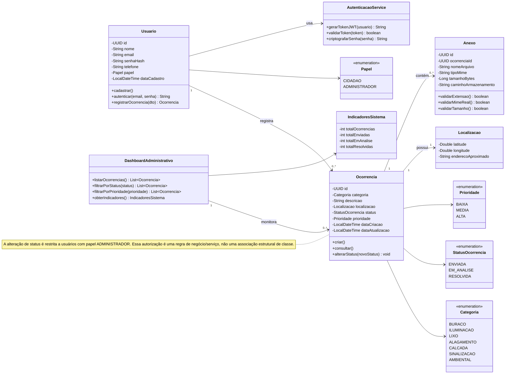

# Diagrama de Classe - Sistema de Registro de Ocorrências Urbanas

Diagrama de classe elaborado a partir do levantamento de requisitos (RF01–RF06 e RNFs), cobrindo cadastro/autenticação de usuários, registro e consulta de ocorrências, gestão de status pelo administrador e painel administrativo.

> **Revisão (PR #6 — docs(DB-01)):** esta versão corrige as inconsistências apontadas entre o DER e o diagrama de classes. Ver seção "Ajustes desta revisão" ao final.

## Observações de modelagem

- **Usuario/Papel**: um único modelo de usuário com o atributo `papel` (CIDADAO ou ADMINISTRADOR) evita duplicação de tabelas e simplifica a autenticação via JWT (RNF-S01); a checagem de permissão (ex.: alterar status) é feita a partir do papel, como regra de negócio na camada de serviço — não como uma associação estrutural separada entre `Usuario` e `Ocorrencia`.
- **Ocorrencia**: concentra os dados do RF03 (categoria, descrição, localização) e do RF05 (status controlado pelo administrador). A fotografia deixou de ser um atributo de `Ocorrencia` e passou a ser representada exclusivamente pela entidade `Anexo`, eliminando a duplicidade entre `foto_url` e a tabela de anexos.
- **Anexo**: isolado da Ocorrencia para acomodar as regras do RNF-S04 (validação de extensão, MIME real, tamanho e armazenamento sem execução de scripts). Uma ocorrência pode ter zero ou vários anexos (`0..*`), permitindo múltiplas imagens por registro.
- **Categoria**: enum padronizado com o DER do projeto (BURACO, ILUMINACAO, LIXO, ALAGAMENTO, CALCADA, SINALIZACAO, AMBIENTAL), evitando que backend, banco e documentação implementem conjuntos de valores diferentes.
- **Identificadores**: todas as chaves primárias e estrangeiras (`id`, `ocorrenciaId` etc.) são do tipo UUID nativo do PostgreSQL, não `VARCHAR`.
- **Localizacao**: modelada como classe embutida (value object) para facilitar futura integração com módulos de mapas (RNF-D02).
- **DashboardAdministrativo/IndicadoresSistema**: suportam o RF06, agregando dados sem duplicar informação já presente em Ocorrencia.
- **AutenticacaoService**: separa a lógica de segurança (hash de senha, emissão/validação de JWT) das entidades de domínio, alinhado ao RNF-S01 e RNF-S02.

## Ajustes desta revisão (em resposta ao review do PR #6)

| # | Problema apontado | Ajuste aplicado |
|---|---|---|
| 1 | Cardinalidade de Anexo divergente (DER: 1:N / Diagrama: 0..1) | Diagrama corrigido para `Ocorrencia "1" --> "0..*" Anexo` |
| 2 | Categorias divergentes entre DER e diagrama | Diagrama passou a usar o enum do DER: `BURACO, ILUMINACAO, LIXO, ALAGAMENTO, CALCADA, SINALIZACAO, AMBIENTAL` |
| 3 | UUID documentado como VARCHAR | Identificadores confirmados como `UUID` nativo em todas as entidades |
| 4 | Duplicidade entre `foto_url` e `Anexo` | Atributo `fotoUrl` removido de `Ocorrencia`; `Anexo` passa a ser a única fonte oficial da imagem |
| 5 | Relacionamento estrutural "altera status (ADMINISTRADOR)" | Associação removida do diagrama; a regra passou a ser descrita como nota (`note for Ocorrencia`), já que é uma autorização de serviço baseada no papel do usuário, não uma associação de classe |

O diagrama acima está em sintaxe Mermaid, então é renderizado automaticamente em visualizadores compatíveis (GitHub, VS Code, Notion, etc.) ou pode ser colado em ferramentas como o Mermaid Live Editor.
