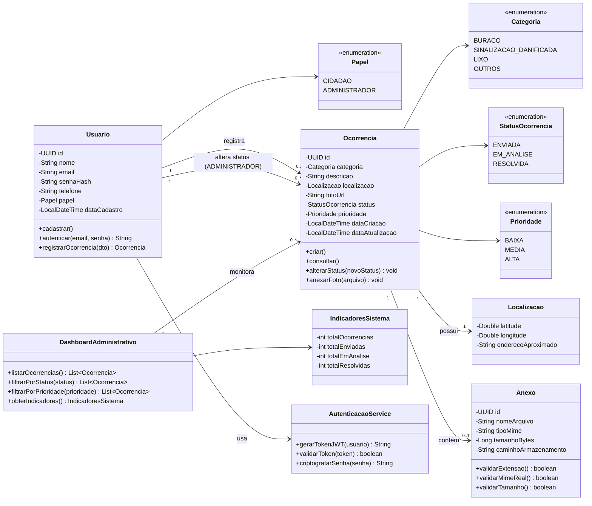

# Diagrama de Classe - Sistema de Registro de Ocorrências Urbanas

Diagrama de classe elaborado a partir do levantamento de requisitos (RF01–RF06 e RNFs), cobrindo cadastro/autenticação de usuários, registro e consulta de ocorrências, gestão de status pelo administrador e painel administrativo.

## Observações de modelagem

- **Usuario/Papel**: um único modelo de usuário com o atributo `papel` (CIDADAO ou ADMINISTRADOR) evita duplicação de tabelas e simplifica a autenticação via JWT (RNF-S01), já que a checagem de permissão (ex.: alterar status) é feita pelo papel.
- **Ocorrencia**: concentra os dados do RF03 (categoria, descrição, localização, foto opcional) e do RF05 (status controlado pelo administrador).
- **Anexo**: isolado da Ocorrencia para acomodar as regras do RNF-S04 (validação de extensão, MIME real, tamanho e armazenamento sem execução de scripts).
- **Localizacao**: modelada como classe embutida (value object) para facilitar futura integração com módulos de mapas (RNF-D02).
- **DashboardAdministrativo/IndicadoresSistema**: suportam o RF06, agregando dados sem duplicar informação já presente em Ocorrencia.
- **AutenticacaoService**: separa a lógica de segurança (hash de senha, emissão/validação de JWT) das entidades de domínio, alinhado ao RNF-S01 e RNF-S02.

O diagrama acima está em sintaxe Mermaid, então é renderizado automaticamente em visualizadores compatíveis (GitHub, VS Code, Notion, etc.) ou pode ser colado em ferramentas como o Mermaid Live Editor.
